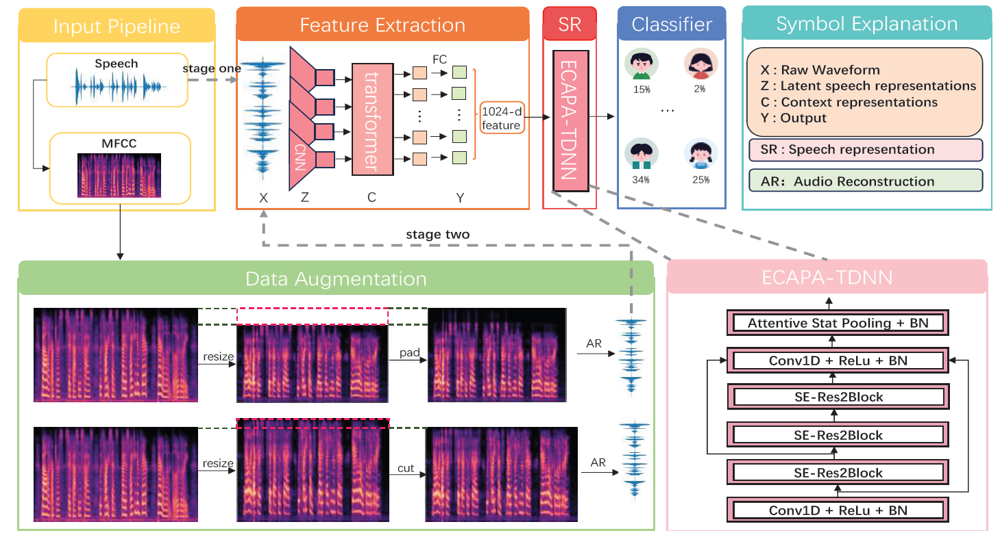

# SpecWav-Attack
A robust adversarial model leveraging spectrogram resizing and Wav2Vec 2.0 for attacking anonymized speech.

---

## 📄 Abstract

SpecWav-Attack focuses on exploiting vulnerabilities in anonymized speech systems. The model incorporates:
- **Spectrogram Resizing (SR):** To distort speaker-specific features while retaining content-related information.
- **Wav2Vec 2.0:** For self-supervised feature extraction, generating high-dimensional embeddings to enrich speech representations.
- **Incremental Training:** A two-phase training process to enhance model robustness and avoid overfitting.

Evaluated on **LibriSpeech-dev** and **LibriSpeech-test**, SpecWav-Attack consistently outperforms traditional approaches, revealing significant vulnerabilities in anonymized speech systems.

---

## 🏗️ Architecture

The architecture of SpecWav-Attack includes:
1. **Preprocessing:**
   - Vertical resizing of Mel spectrograms to distort speaker features.
2. **Feature Extraction:**
   - Utilizing Wav2Vec 2.0 to generate 1024-dimensional embeddings.
3. **Classifier:**
   - A modified ECAPA-TDNN model for speaker identification tasks.

---

## 📊 Results

### Equal Error Rate (EER) Performance

| Dataset            | Gender  | Orig. | T8-5 | T10-2 | T10-2 (SW) | T12-5 | T12-5 (SW) | T25-1 | T25-1 (SW) |
|--------------------|---------|-------|------|-------|------------|-------|------------|-------|------------|
| **LibriSpeech-dev**| Female  | 10.51 | 39.63| 43.63 | **33.92**  | 43.32 | **35.09**  | 42.65 | **35.80**  |
|                    | Male    | 0.93  | 40.84| 40.04 | **28.76**  | 44.10 | **34.80**  | 40.06 | **37.12**  |
| **Average dev**    |         | 5.72  | 40.24| 41.83 | **31.34**  | 43.71 | **34.95**  | 41.36 | **36.46**  |
| **LibriSpeech-test**| Female | 8.76  | 42.50| 41.97 | **25.91**  | 43.61 | **34.85**  | 42.34 | **35.58**  |
|                    | Male    | 0.42  | 40.05| 29.85 | **27.17**  | 41.88 | **34.52**  | 41.92 | **35.19**  |
| **Average eval**   |         | 4.59  | 41.28| 40.36 | **26.54**  | 42.75 | **34.69**  | 41.35 | **36.39**  |

SW indicates the **SpecWav** solution.

---

## 📂 Repository Structure
```
SpecWav-Attack/ 
├── data/ # Scripts for data preprocessing and augmentation 
├── models/ # SpecWav-Attack architecture implementation ├── experiments/ # Training and evaluation scripts 
├── results/ # Evaluation metrics and results 
├── README.md # Project documentation 
└── requirements.txt # Python dependencies
```
---

## 🚀 Getting Started

### Installation
1. Clone the repository:
   ```bash
   git clone https://github.com/your-username/SpecWav-Attack.git
   cd SpecWav-Attack
   ```
2. Install dependencies:
    ```bash
    ./00_install.sh
    source env.sh
    pip install -r requirements.txt
    ```
3. For details on initial environment setup, please refer to VoicePrivacy2024(https://github.com/Voice-Privacy-Challenge/Voice-Privacy-Challenge-2024)


### Download data
Contestants can receive download data email.


### Training 
To train the SpecWav-Attack model:
```bash
python train.py --dataset [DATASET_PATH]

```

### Evaluation
To evaluate the trained model:
```bash
python evaluate.py --model [MODEL_PATH] --dataset [DATASET_PATH]
```


## 📚 Citation
If you use SpecWav-Attack in your research, please cite:

```css
@article{specwav_attack,
  title={SpecWav-Attack: Leveraging Spectrogram Resizing and Wav2Vec 2.0 for Attacking Anonymized Speech},
  author={Yuqi Li, Yuanzhong Zheng, Zhongtian Guo, Yaoxuan Wang, Jianjun Yin, Haojun Fei},
  journal={ICASSP Attacker Challenge},
  year={2025}
}

```

## Reference
```css
@article{tomashenko2024voiceprivacy,
      title={The {VoicePrivacy} 2024 Challenge Evaluation Plan}, 
      author={Natalia Tomashenko and Xiaoxiao Miao and Pierre Champion and Sarina Meyer and Xin Wang and Emmanuel Vincent and Michele Panariello and Nicholas Evans and Junichi Yamagishi and Massimiliano Todisco},
      year={2024},
      eprint={2404.02677},
      archivePrefix={arXiv},
      primaryClass={eess.AS}
}
```